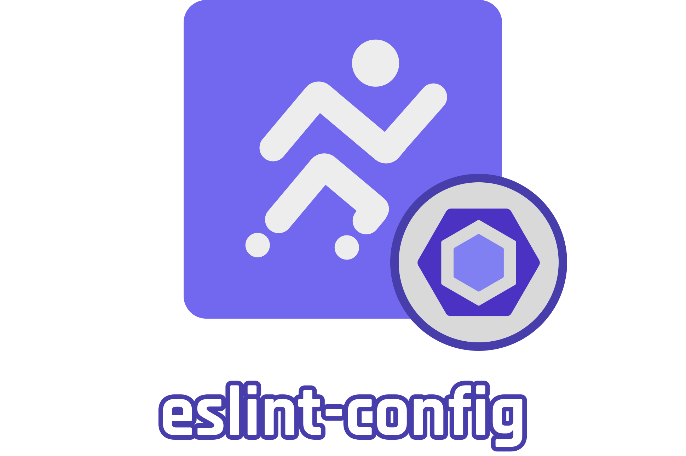

<div>
    <p align="center">
        
    </p>
    <hr>
</div>

> ESLint configuration for Joggr projects. 

## Installation

### Yarn

```bash
$ cd <root>
$ yarn add -D eslint-config-joggr
```

### NPM

```bash
$ cd <root>
$ npm install --save-dev eslint-config-joggr
```

## Usage

`.eslintrc.cjs`
```js
module.exports = {
  root: true,
  extends: ["joggr"],
  parserOptions: {
    tsconfigRootDir: __dirname,
    project: ['./tsconfig.json'],
  },
};
```

### Adding Import Order Groups

You can add import order groups by extending the `joggr` config and overriding the `import/order` rule.


[View File](.eslintrc.js)

```js
module.exports = {
  root: true,
  extends: ['joggr'],
  overrides: [
    {
      files: ['*'],
      rules: {
        'import/order': [
          'error',
          {
            pathGroups: [
              {
                pattern: '@lint/*',
                group: 'internal',
                position: 'before',
              },
            ],
          },
        ],
      },
    },
  ],
  parserOptions: {
    tsconfigRootDir: __dirname,
    project: ['./tsconfig.json'],
  },
};
```

## License

Licensed under MIT.

<br>
<hr>
<h2 align="center">
    Want to sign up for Joggr?
</h2>
<p align="center">
    We'd love to have you join, but we are in closed beta. <br> You can join our waitlist below.
</p>
<p align="center">
    <a href="https://www.joggr.io/closed-beta-waitlist?utm_source=github&utm_medium=org-readme&utm_campaign=static-docs" alt="Join the Waitlist">
        
    </a>
</p>
